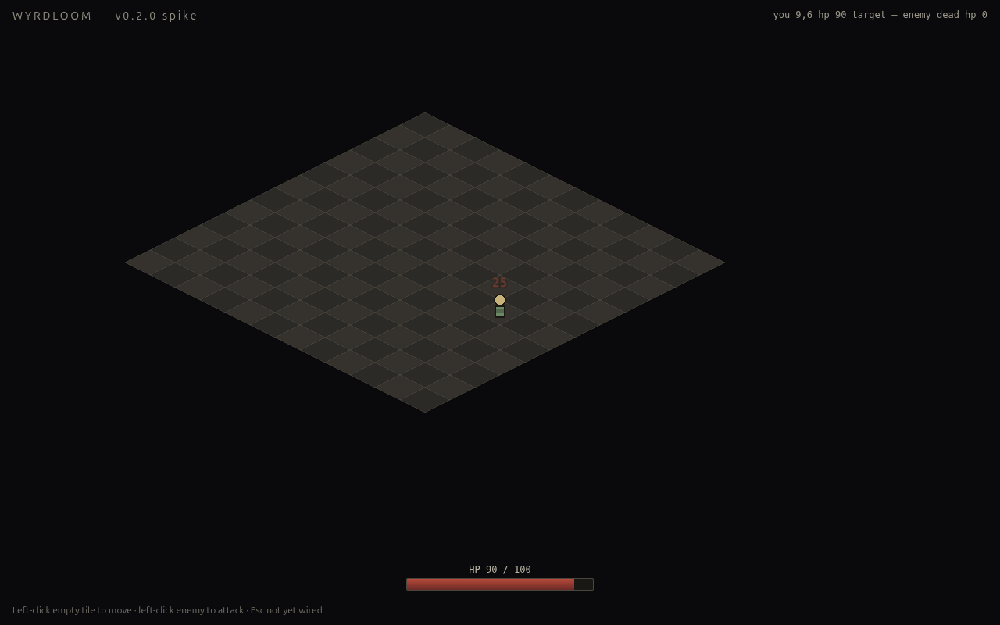

# WYRDLOOM

Single-player isometric action-RPG in the Diablo / Path-of-Exile lineage. **Open-source**, **MIT-licensed**, **no telemetry**, **no microtransactions**, **no online-only DRM**. Ships as both a browser demo and signed native desktop binaries from the same TypeScript source.

> Status: **v0.2.0 — Week 2: combat skeleton.** Pixi iso canvas + click-to-move + 1 enemy with chase AI + 1 player skill (melee) + HP bar + damage popups + full death/respawn cycle. See `RELEASE_NOTES_v0.2.md`.



## What's in v0.2.0

- 12×12 isometric grid, procedural sprites (real Kenney + LPC art lands in v0.3.0 — pack URLs were 404 at last attempt; manual download script is the next pass)
- Click-to-move and click-to-attack
- 1 enemy with chase-and-melee AI (aggro range 5, attack on adjacency)
- Player melee skill: 25 dmg, 1-tile range, 400 ms cooldown
- DOM HP bar + floating Pixi-rendered damage popups (kill popup styled distinct from hit)
- Full death + respawn loop for both player (2 s, back to (6,6) full HP) and enemy (3 s, random edge tile, full HP)
- Pure-TS combat math in `src/systems/combat.ts` and `src/systems/ai.ts` — Vitest covers every transition

## What's in v0.1.0

- 12×12 isometric grid, click-to-move pathing
- Pixi v8 + WebGL rendering, Tauri 2.x shell scaffolded
- Capability allow-list locked: FS scoped to `$APPDATA/wyrdloom/saves`, window controls, dialog — no `http:`, `shell:`, `process:`
- Vitest unit tests for iso math, Playwright e2e for boot + click-to-move
- License-compliance CI gate

## Stack

| | |
|---|---|
| Renderer | [PixiJS v8](https://pixijs.com) (MIT) |
| Language | TypeScript 5.x strict |
| Bundler | [Vite 6](https://vite.dev) |
| Native shell | [Tauri 2.x](https://tauri.app) (MIT/Apache-2.0) |
| Audio | [howler.js](https://howlerjs.com) (MIT) — wired for v0.6.0 |
| Storage | [idb](https://github.com/jakearchibald/idb) (ISC) for web, `@tauri-apps/api/fs` for native |
| Procgen RNG | [seedrandom](https://github.com/davidbau/seedrandom) (MIT) |
| Tests | [Vitest](https://vitest.dev) + [Playwright](https://playwright.dev) |
| Pkg mgr | [bun](https://bun.sh) (preferred) — `pnpm` fallback |

## Controls (v0.2.0)

| Action | Binding |
|---|---|
| Move | Left-click an empty tile |
| Attack enemy | Left-click an enemy (player walks into melee, then auto-attacks) |
| Quit | Close the window — there's no menu yet |

Full keymap (hotbar, inventory, character, talents, …) lands by Week 4.

## Build from source

### Prerequisites

- Node ≥ 20
- Bun ≥ 1.3 (or pnpm ≥ 9)
- Rust ≥ 1.77 (`rustup default stable`) — only required for the Tauri native build
- Linux: `libwebkit2gtk-4.1-dev libssl-dev libgtk-3-dev libayatana-appindicator3-dev librsvg2-dev`

### Web target (browser demo)

```bash
bun install
bun run dev          # http://127.0.0.1:1420
bun run build        # dist/ (static; serve from anywhere)
```

### Native target (Tauri)

```bash
bun run tauri:dev    # native window + Vite dev server
bun run tauri:build  # platform-specific bundle in src-tauri/target/release/bundle/
```

The Tauri bundle target is whichever OS you're building on:

- Linux → `.AppImage` and `.deb`
- Windows → `.msi`
- macOS → `.dmg`

## Run the tests

```bash
bun run typecheck     # tsc --noEmit
bun run lint          # ESLint, max-warnings 0
bun run test          # Vitest unit tests
bun run test:e2e      # Playwright Chromium + WebKit
bun run check:licenses # asset attribution + Tauri capability gate
```

CI (GitHub Actions) runs all of the above on `ubuntu-22.04 / windows-latest / macos-latest`.

## Repo layout

```
src/                  # game source (TS strict)
  engine/             # Pixi wrappers, iso math, input
  systems/            # save adapter, loot, stats — landing later
  ui/                 # DOM HUD overlay
  platform/           # Tauri vs web split (save adapter)
src-tauri/            # Rust shell + capability allow-list
  capabilities/       # FS+window+dialog only (BUILD_PROMPT §2.5)
assets/               # bundled at build time; never CDN-loaded
data/                 # JSON: items, affixes, uniques, gems
tests/{unit,e2e}/
tools/                # license gate, version sync (TS, run via bun)
docs/{adr,…}/         # architecture decision records
```

## License

WYRDLOOM source: **MIT** (see `LICENSE`).

Third-party assets and libraries: tracked row-by-row in `LICENSES.md`. We accept only CC0 / CC-BY / CC-BY-SA (LPC carve-out) / OFL / MIT / Apache-2.0. The CI license gate fails the build on any unattributed asset folder.

## Spec

The full design + scope spec is in `BUILD_PROMPT.md`. That file is the canonical source of truth — any divergence between this README and the spec defers to the spec.
