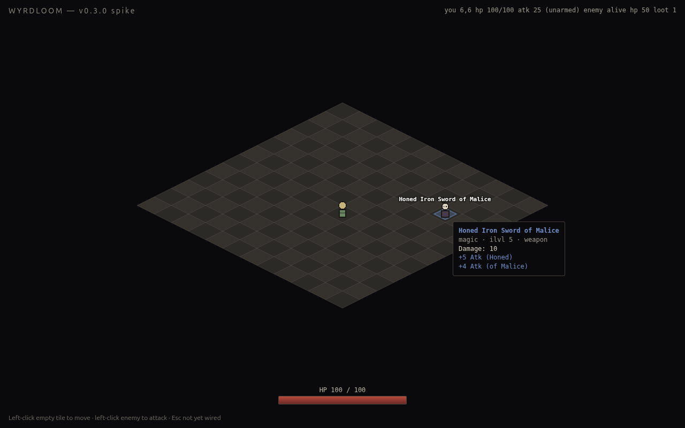

# WYRDLOOM v0.3.0 — Week 3: loot pipeline

Loot is alive. Enemies drop items on death, items glow on the ground in their rarity color, hovering shows a tooltip with affixes, click-to-pick-up auto-equips, and the equipped weapon's stats actually flow into combat damage.

## What ships

### Type-safe item data model (`src/types/items.ts`)

Discriminated union on `ItemMod['type']` — adding a new mod variant fails the build at every consumer that doesn't handle it.

- `Rarity`: `common | magic | rare | unique | mythic` (only the first three are rolled in v0.3.0; uniques + mythics arrive in v0.5.0 / v0.10.0).
- `Slot`: `weapon | head | chest | ring`.
- `RARITY_COLOR`: 5-entry palette used by both Pixi sprites and DOM tooltips, so colors stay consistent without per-site repetition.
- `BaseItem`, `Item`, `RolledAffix`, `AffixDef`, `AffixFile`, `ItemFile` — shapes match `data/*.json` 1:1.

### Authored data (`data/items.json`, `data/affixes.json`)

12 base items (3 per slot, ilvl 1/5/10) and 16 affixes (10 prefixes + 6 suffixes) covering both `atk_flat` and `hp_flat` modifiers across 5 tiers. Room to grow to the spec's 200×200 prefix/suffix target by v0.6.0 without touching code.

### Loot roller (`src/systems/loot.ts`)

- `rollDrop({ monsterLevel, seed })` returns `Item | null`. Pure function — same seed → same item, every time. Uses **`seedrandom`** (xorshift128).
- 80% drop chance, weighted rarity pick (50/35/15 common/magic/rare for v0.3.0 spike numbers).
- Base picked from the eligible pool (ilvl ≤ monsterLevel), weighted toward closer ilvl.
- Affix counts per rarity: common 0, magic 1 prefix + 0–1 suffix, rare 1–2 prefixes + 1–2 suffixes.
- Affix pool filtered by slot eligibility + tier cap (`tier ≤ ⌊ilvl/5⌋ + 1`).
- Vitest covers determinism, ilvl cap, common-no-affixes, rare-≥2-affixes, slot eligibility, value range.

### Inventory + stat recalc (`src/systems/inventory.ts`)

- `Equipment = Partial<Record<Slot, Item>>` — the player owns one.
- `equip(equipment, item)` — slot-replace, returns previous occupant.
- `computeDerivedStats(baseAtk, baseMaxHp, equipment)` — exhaustive switch over `ItemMod['type']`. Atk = base + every `baseDamage` + every `atk_flat` value. MaxHp = base + every `hp_flat`. Armor = sum of `baseArmor`.

### Actor refactor

`Actor` now carries `equipment` + `derivedStats` alongside the immutable `stats`. Combat reads `attacker.derivedStats.atk` instead of `attacker.stats.atk`, so equipped weapons feed damage automatically — **no combat code touched**. `derivedStats` initializes to `stats` so existing combat tests pass unmodified.

### Drop on death + ground items (`src/fx/ground_item.ts`)

- Killing an enemy seeds `rollDrop({ seed: enemyId-killCount-tickMs })` and (if non-null) spawns a `GroundItemView` at the enemy's death tile.
- Ground items render as a glowing diamond in rarity color + a label above with the item's full name. Pulse animation (alpha + scale breathing on `Math.sin(elapsed/280)`) keeps them visible against the tile pattern.

### Tooltip on hover (`src/ui/tooltip.ts`)

DOM-overlaid (per spec §6.1 — HUD is DOM, never in-canvas). Pointermove on the world container triggers the tooltip; pointerleave clears it. Shows: name (rarity color), `magic · ilvl 5 · weapon` subtitle, base damage / armor, every rolled affix in `+N Atk (Affix Name)` form, and — when applicable — the currently-equipped item from the same slot for compare.

### Pickup mechanics

D2-coded "click to walk to loot, click again to pick up". The click handler checks for ground items first (before enemies) and routes:

- Ground item on this tile, player elsewhere → walk to that tile.
- Ground item on this tile, player on this tile → `pickUp()` → `equip()` + `recompute derivedStats` + remove view + (if a previous item was replaced) drop the replaced item back at the player's tile.

When `derivedStats.maxHp` shrinks (unequipping a +HP item), `player.hp` is clamped down to the new max.

### Dev hooks (test-only)

- `__wyrdloom.dev.setPlayerHp(n)` — already there from v0.2.0.
- `__wyrdloom.dev.forceDrop(seed, tile?)` — bypasses the 80% drop roll, drops at `tile` or the enemy's tile. Used by 4 e2e tests so we don't have to wait for random rolls. Out-of-band, namespaced under `dev` to make the test-only intent obvious.

## Verification

| Layer | Result |
|---|---|
| Vitest unit (combat, AI, iso math, loot, inventory) | **27/27 pass** |
| Playwright e2e (chromium, 13 tests) | **13/13 pass** |
| ESLint, max-warnings 0 | clean |
| TypeScript strict + `noUncheckedIndexedAccess` | clean |
| License + capability gate | clean (no new assets, no new permissions) |

Live-driven with Playwright MCP through the full loot loop:

- `forceDrop('weapon-seed-17')` → ground item "Honed Iron Sword of Malice" (magic, baseDamage 10, +9 Atk Honed, +1 Atk of Malice) at (9, 3).
- Pointermove on item tile → tooltip renders with name in `#6e8fc9` magic blue, base damage line, both affix lines.
- Click (9,3) at viewport (832, 400) → player walks (6,6) → (9,3).
- Second click at (640, 400) (camera-following → maps to player's tile) → pickup. `equipment.weapon = Honed Iron Sword`. `derivedStats.atk = 25 + 10 + 9 + 1 = 44` ✓ matches expectation from the spec.
- Force-drop a Rusty Dagger at the player's tile → click → swap. Old Iron Sword drops back at the player's tile. New atk = 25 + 5 = 30.

## Caveats

- **Real Kenney + LPC art still deferred** — the v0.2.0 ADR 0002 reasoning still holds; v0.4.0 ships the asset-pipeline work alongside the inventory grid + character sheet UI.
- **Tile collision still missing** — enemies and items can stack on the player's tile; `forceDrop(seed, tile)` exists specifically to sidestep enemy-tile drift in tests. Real path-blocking lands in v0.5.0 with A*.
- **Gold + currency** — not implemented. v0.4.0.
- **Inventory grid** — items go directly into equipment slot on pickup, no inventory backing store. The 10×4 D2-style grid lands in v0.4.0 with the inventory UI.
- **Sockets, gems, crafting** — pure data design only. v0.8.0 ships the actual systems.

## Notable design decisions

### `derivedStats.atk` not `stats.atk`

Combat math reads `attacker.derivedStats.atk`. The temptation was to mutate `actor.stats` on equip — but `stats` is the immutable base; mutating it would conflate "what was this actor born with" with "what does it hit for right now." Keeping them separate means tests like "raw enemy attacks deal exactly `ENEMY_STATS.atk`" still work without weird re-resetting on every equip. (And enemies don't equip anything in v0.3.0, so their `derivedStats` always equals their `stats`.)

### Ambient `.d.ts` outside the test directory

The shared `Window.__wyrdloom` type lived in `tests/e2e/wyrdloom-global.d.ts` initially — Playwright's project loader treated it as a test file and silently dropped all projects (`Available projects: ""`). Moved to `tests/types/wyrdloom-global.d.ts` and pulled in via `/// <reference path="..."` from each spec file. Ambient (no top-level import/export) so `interface Window` merges globally without needing `declare global`.

### Determinism is load-bearing

Every `rollDrop` is seeded by a string the test can control. The unit tests assert `rollDrop({ seed: 'X' }) === rollDrop({ seed: 'X' })`. This isn't just hygiene — it's how saves work in v0.6.0 (a save file replays loot from the seed) and how the bot-play DoD harness works in v1.0.0 (deterministic 1-hour run).

## Next: v0.4.0 (Week 4)

Per spec §10: inventory + character sheet + skill hotbar + bind-skill flow. The DOM UI layer becomes load-bearing — Lit 3.x is the most likely choice for the panels. Picking up a second weapon will go into the inventory grid instead of replacing the equipped slot, and we'll wire up the talent-grid placeholder for v0.7.0's class balance pass.

Likely also: vendor real Kenney + LPC art (deferred from v0.2.0 and v0.3.0; ADR 0002 lineage). The asset pipeline work has been ducking the deadline twice — v0.4.0 needs to absorb it or it slips to a permanent backlog item.
