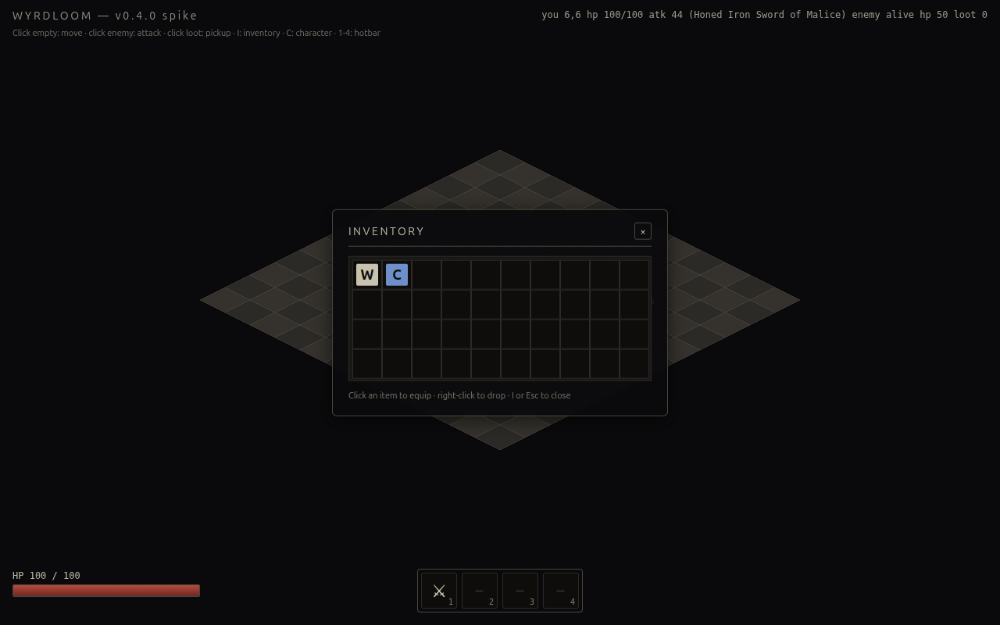
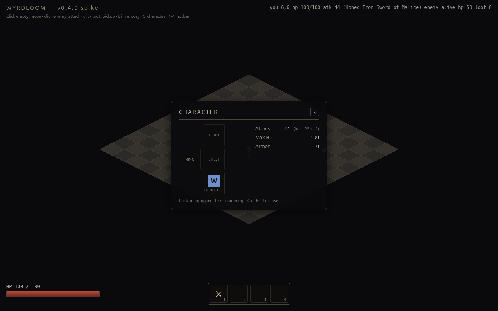

# WYRDLOOM v0.4.0 — Week 4: inventory + character + hotbar + bind

The HUD is no longer a single HP bar. There's a 10×4 D2-coded bag, a paper-doll character sheet, a 4-slot skill hotbar, and a real bind-skill flow — all DOM, all built on Lit 3 web components, all Esc-dismissable.

## What ships

### Inventory backing store (`src/systems/bag.ts`)

10 columns × 4 rows. Items track an `(x, y, w, h)` footprint so v0.5.0 can introduce 1×2 / 1×3 multi-cell items without changing call sites — every item is 1×1 in v0.4.0. Pure data + functions:

- `addItem(inv, item)` — first-fit row-major, returns the placed slot or null.
- `removeItem(inv, uid)` — by uid; returns the slot.
- `hasRoomFor(inv, item)` — boolean reachability check.
- `footprintFor(item)` centralizes the size lookup; new variants light up red at every consumer.

### Pickup flow rewritten

Pickup goes into the bag, not the equipment slot. If the bag is full, the pickup is rejected and the item stays on the ground. Equipping is now an explicit user action: open inventory (`I`), click a cell. Replaced gear returns to the bag (or drops to the floor if the bag is now full because the new item was the last empty cell).

### Lit 3 panel framework (`src/ui/panel.ts`)

Shared `WyrdPanel` base class:

- Listens for `wyrdloom:panel-toggle` CustomEvents on `window`, filtering by `panelId`.
- Reflects `open` to a host attribute → `:host([open])` controls `display`.
- Header with title + close button, body delegated to `renderBody()`.

`#hud` is unchanged from v0.3.0 — it's still `pointer-events: none` at the container level, with `pointer-events: auto` on the panels themselves so canvas clicks fall through everywhere else.

### Inventory panel (`src/ui/inventory_panel.ts`)

10×4 grid via CSS grid (`grid-template-columns: repeat(10, 36px)`). Each cell is a single CSS rule with `data-testid="inv-cell-X-Y"`. Items render as a glyph (W/H/C/R until LPC art lands) on a rarity-tinted square. Click → equip. Right-click → drop at the player's tile. Hovering uses the native `title` attribute; the in-canvas tooltip stays for ground items.

### Character panel (`src/ui/character_panel.ts`)

Paper-doll layout via CSS grid template areas — `head` top, `chest` middle, `weapon` bottom, `ring` to the side. Each slot is `paperdoll-${slot}` for tests. Click an equipped slot → unequip. Stat readout on the right: Attack, Max HP, Armor, with `(base X +Y)` deltas when equipment contributes.

### Hotbar (`src/ui/hotbar.ts`)

Always-visible at the bottom-center. 4 slots, keys 1-4. Click an empty (or bound) slot → opens the bind panel. Right-click → clears. The shared mutable `pendingBindSlot` module-state passes the target slot to the bind panel — set BEFORE dispatching the open event, since `dispatchEvent` is synchronous and listeners read it inline.

### Bind-skill flow (`src/ui/bind_panel.ts` + `src/systems/skills.ts`)

Catalog of available skills lives in `src/systems/skills.ts` — v0.4.0 ships with one (`melee`); v0.5.0 fills out the four-skill set per spec §3. Pick a skill → `setHotbarBinding(slotIndex, { skillId, label })` writes into `gameState.hotbar` and notifies subscribers; bind panel auto-closes.

### Game-state bridge (`src/ui/store.ts`)

Tiny pub/sub layer between the Pixi-driven game loop and Lit panels:

- `gameState` — mutable singleton holding inventory, equipment, derived stats, hotbar.
- `notifyState()` — fires `wyrdloom:state-changed`; panels re-render on receipt.
- Three intent events (`equip`, `unequip`, `drop`) — emitted by panels, handled in `main.ts`.

The split is one-way: panels read state and emit intents; game loop writes state and routes effects. No Pixi imports in any Lit module.

### HUD reshuffle

HP bar moved to bottom-left to free the bottom-center for the hotbar (D2 globes-flank-hotbar pattern). Hint text moved to top-left under the title bar. Debug readout still top-right.

## Verification

| Layer | Result |
|---|---|
| Vitest unit (combat, AI, iso, loot, inventory, **bag**) | **34/34 pass** |
| Playwright e2e (chromium + webkit, 21 specs each) | **42/42 pass** |
| ESLint, max-warnings 0 | clean |
| TypeScript strict + `noUncheckedIndexedAccess` + `noImplicitOverride` | clean |
| License + capability gate | clean |

Live-driven through the Playwright MCP loop:

- `dev.giveItem('weapon-seed-17')` → bag `[Honed Iron Sword of Malice]` at (0,0).
- `dev.equipFromInventoryByUid(uid)` → equipped `weapon: Honed Iron Sword of Malice`; `playerAtk = 25 + 10 + 5 + 4 = 44`. Character panel reads `Attack 44 (base 25 +19)`. ✓
- Bind hotbar slot 1 → click `wyrd-hotbar [data-testid="hotbar-0"]` → click `wyrd-bind [data-testid="bind-skill-melee"]` → `gameState.hotbar[0] = { skillId: 'melee', label: '⚔' }`. ⚔ glyph visible in slot 1. ✓
- Right-click slot 1 → `gameState.hotbar[0] = null`; bind cleared.
- `i` toggles inventory; `c` toggles character; `Esc` closes both.

## Caveats

- **Real Kenney + LPC art deferred for the third time.** Spec §10 had this as a v0.4.0 must — see ADR 0003 for why it's now a manual-only backlog item. Glyph-based fallback is good enough through v0.7.0; nothing further blocks on it.
- **Hotbar 1-4 is observational only.** v0.4.0 only has the `melee` skill, which is already wired through click-to-attack. Pressing `1` dispatches `wyrdloom:skill-trigger` but nothing executes — v0.5.0 fills in real skill execution alongside the four-skill set.
- **Item glyphs are a single character** until LPC inventory icons land. Rarity color does the heavy lifting for now.
- **No tooltip in the inventory grid** — uses the native `title` attribute. The in-canvas tooltip (v0.3.0) still works on ground items. The matching DOM tooltip on inventory cells lands in v0.5.0.
- **Sockets, gems, gold, vendor UI** — still v0.6.0 / v0.8.0 per spec.

## Notable design decisions

### `experimentalDecorators: true` for Lit 3

Lit 3's `@property` / `@state` decorators rewrite the property setter to trigger reactive re-renders. With TS 5 + `useDefineForClassFields: true` (the ES2022-target default) class fields become `Object.defineProperty` calls that override the decorator's accessor — the decorator runs but its setter never fires. Switching to `experimentalDecorators: true` + `useDefineForClassFields: false` is the path of least friction; the alternative (TC39 standard decorators with the `accessor` keyword) requires sprinkling `accessor` in front of every reactive field.

### Inventory grid with cell footprint, not just an item array

Future-proofing for v0.5.0+ multi-cell items (two-handed weapons, polearms). Every item carries `{ w, h }` even though every v0.4.0 item is 1×1. The placement search is row-major first-fit; rejection on full bag is exact. When 1×3 polearms arrive, `footprintFor()` becomes a switch and the rest of the system already handles overlap correctly.

### Mutable shared state for bind-target

`pendingBindSlot.value` is module-scope mutable state shared between the hotbar (writer) and the bind panel (reader). The cleaner refactor would be a dedicated `wyrdloom:bind-request` event with `{ slotIndex }` in the detail; the current design routes through the generic panel-toggle event, which forces the writer-before-dispatcher ordering. Documented as a known smell in `src/ui/hotbar.ts` for v0.5.0.

### Synchronous `dispatchEvent` ordering bug fixed during build

First implementation dispatched panel-toggle THEN set `pendingBindSlot.value`. Listeners ran synchronously inside `dispatchEvent`, read the not-yet-written value, and bound `null`. Both bind tests caught it. Fix: write shared state before firing events whose listeners depend on it.

## Next: v0.5.0 (Week 5)

Per spec §10:

- Procgen tile map (Wave Function Collapse or template-based dungeon assembly)
- A* path-blocking (closes the v0.3.0 `forceDrop(seed, tile)` workaround)
- Three more player skills (cleave, dash, projectile-bolt) bound through the existing hotbar
- Inventory panel tooltip on hover (matches the in-canvas ground-item tooltip)
- Possibly: 1×2 / 1×3 inventory items now that the footprint API exists

Real-art question stays parked unless the user manually downloads the LPC + Kenney packs and lands the LICENSES.md attributions; the license gate enforces this is a no-shortcut path.
