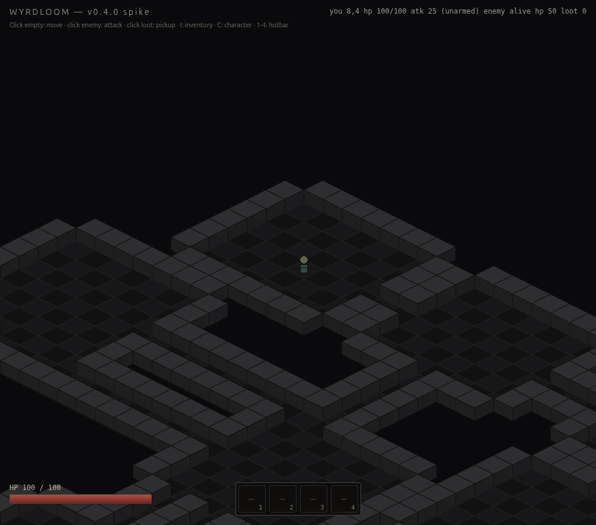
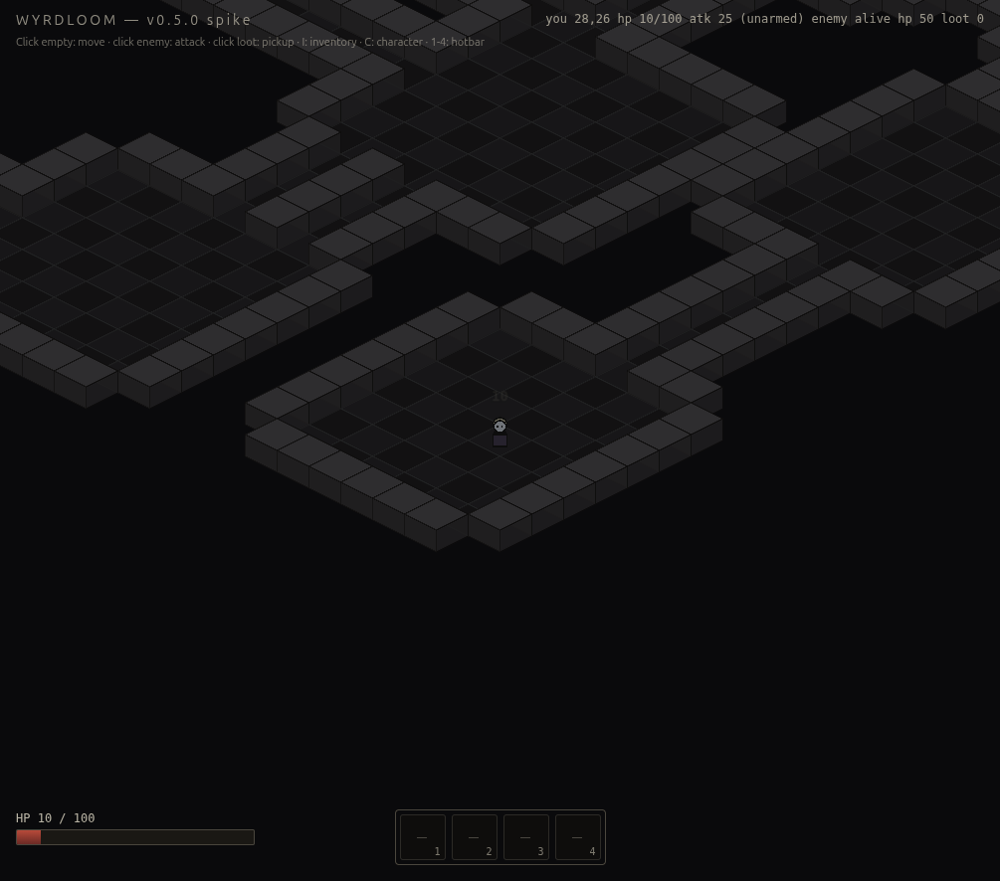

# WYRDLOOM v0.5.0 — Week 5: BSP procgen + Catacombs + A* pathfinding

The world is no longer a 12×12 colored grid. Each session boots into a 32×32 BSP-generated dungeon with rooms, corridors, walls that block both sight and walking, and an entrance + boss room placed at opposite corners. Same seed → same dungeon, every time. The flood-fill validator runs *before* the generator yields, so callers never see an unreachable layout.



## What ships

### BSP room-and-corridor procgen (`src/systems/procgen.ts`)

- Recursive bounds-split until each leaf is at least `minRoomSize` (8) on each axis — picks the longer axis to split, ties broken by RNG.
- One room carved per leaf with a 1-cell wall border kept clear, so adjacent rooms never touch (corridors handle reachability).
- L-shaped corridors connecting consecutive rooms in BSP-leaf order; elbow direction (horizontal-first vs vertical-first) is rng-picked.
- Public `generateDungeon({ w, h, seed })` returns a validated map. Internal `generateOnce()` is exposed only for the test that confirms the validator actually catches degenerate maps.

### Flood-fill validator with reroll (`procgen.ts:validate`)

- BFS from `entrance` room center; counts floor cells reached vs total floor cells.
- If the count mismatches (any floor is unreachable), the generator rerolls with `seed#r1`, `seed#r2`, ... up to 16 attempts. Empirical: in 12 random seed runs, every first attempt validated. The cap is generous so future tighter constraints (boss-room must be adjacent, hidden rooms, etc.) have headroom.
- Per spec §4.5: "Generator runs flood-fill validator before yielding." Caller never sees an invalid map.

### A* pathfinding (`src/systems/pathfinding.ts`)

- 4-connected uniform-cost grid; Manhattan heuristic (admissible → optimal paths).
- `findPath(grid, start, goal)` returns the inclusive path or null. Self-paths return a single-element array.
- `PathfindGrid` interface decouples the algorithm from procgen — the same A* runs against any walkable-predicate grid (future hand-authored levels, multi-floor dungeons, etc.).
- Linear-scan open-set pop: heap optimization deliberately deferred. For 32×32 grids the open set rarely exceeds 50 nodes.

### Player movement via cached A* path

- Single click → A* run from `playerTile` to clicked tile → cached on `World.playerPath`.
- Player walks one tile per `moveCooldownMs` (150 ms), advancing through the cached array.
- Attack-target retargeting recomputes the path every tick the enemy's tile changes — wasteful but cheap, and the alternative (predictive intercept) is overkill for v0.5.0 mob density.
- Walls reject clicks at the source: the click handler checks `isFloor()` and returns silently if the tile isn't walkable.

### Enemy AI walks around walls (`src/systems/ai.ts`)

- `tickEnemy()` now takes an optional `grid` parameter. With a grid, it runs A* once per move-cooldown tick and steps the first tile of the path.
- Without a grid (existing combat unit tests), it falls back to the v0.4.0 greedy `stepToward` direction picker — preserves backward compatibility so the 9 combat unit tests keep working unchanged.

### Catacombs Pixi tile renderer (`src/fx/tiles.ts`)

- Floor tiles: depth-sorted iso diamonds, alternating dark grey-on-grey checker.
- Wall tiles: stacked block (left face + right face + top diamond), 22 px tall — sorts above floors so they correctly occlude actors behind them.
- **Wall culling** — only "exposed" walls (those with at least one walkable neighbour or grid-edge neighbour) are drawn. Saves ~70% of wall draw calls for typical BSP layouts and keeps the 32×32 dungeon under v0.4.0's draw-call budget.

### Catacombs color grade (`src/main.ts:makeCatacombsGrade`)

- `Pixi.ColorMatrixFilter` applied to the world container — `saturate(-0.25)` + `tint(0x9aa6c0)` + `brightness(0.85)`.
- Affects tiles + actors + ground-item glow uniformly. HUD (HP bar, hotbar, panels) lives in `#hud` so it stays at full saturation.
- Per spec §4.5 + §13: "Per-act color-grade LUT (warm I → cold II → blood III) via `ColorMatrixFilter`." This is the warm→cold transition pre-baked for the catacombs biome; v0.7.0+ swaps the matrix per act.

### Test-only dev hooks (`__wyrdloom.dev`)

Three new helpers added so e2e tests don't have to traverse procgen dungeons:

- `walkTo(tx, ty)` — bypasses canvas-coord math; sets the player goal directly.
- `teleportPlayer(tx, ty)` / `teleportEnemy(id, tx, ty)` — relocates actors onto known floor tiles for combat tests.
- `attackEnemy(id)` — equivalent of clicking a known-alive enemy.
- `dungeon` — read-only handle exposing seed, grid size, room count, entrance + boss tiles.
- `isFloor(tx, ty)` — walkability probe for tests.

## Verification

| Layer | Result |
|---|---|
| Vitest unit (combat, AI, iso, loot, inventory, bag, **procgen**, **pathfinding**) | **50/50 pass** |
| Playwright e2e (chromium + webkit, 28 specs each) | **56/56 pass** |
| ESLint, max-warnings 0 | clean |
| TypeScript strict + `noUncheckedIndexedAccess` | clean |
| License + capability gate | clean (no new assets, no new permissions) |

Live-driven through Playwright MCP:

- Default seed `catacombs-1` → 32×32 dungeon with 9 rooms, entrance (8,4), boss (28,26). Reload → identical dungeon.
- `dev.walkTo(28, 26)` returns path length 43; player traverses entire dungeon in 6.4 s real time, stepping around every wall.
- During traversal, the boss-room enemy's A* AI engaged once it entered aggro range; player took damage on arrival (HP 10/100). Combat + procgen interact correctly.
- (0, 0) click rejected (border wall); goal stays null.
- Validator caught a hand-crafted disconnected map in unit test (two parallel corridors, no link).



## Caveats

- **Single dungeon per session.** No floor transitions, no shrines, no hidden rooms yet — those land alongside Act I content in v0.6.0. Per spec §4.5: "Each dungeon: 3–5 floors, 1 boss room, 1–2 hidden rooms, 1 shrine."
- **Boss room is just a room.** No special encounter, no bigger enemy — just the largest BSP leaf. The Hollow Bishop boss arrives in v0.6.0 with Act I.
- **One enemy.** v0.4.0 had one enemy; v0.5.0 still has one enemy. Population scales in v0.6.0 alongside content.
- **No fog of war / line of sight gate.** Walls render and block walking, but the whole dungeon is visible at boot. LOS arrives in v0.6.0 (or v0.7.0) with the lighting pass.
- **No floor variety.** Catacombs ships flat dark stone. Decoration tiles (rubble, sarcophagi, debris) come with the asset pipeline, deferred per ADR 0003.
- **Real Kenney + LPC art still deferred.** Procedural Pixi `Graphics()` for everything. ADR 0003 stands.

## Notable design decisions

### Validate before yielding, not on demand

The validator could have been a separate `isValid(map)` predicate the caller runs before consuming a map. Instead it lives inside `generateDungeon` and reroll is automatic. Reasoning: the contract is "give me a playable dungeon." A consumer that has to validate can still produce a broken map by accident (forgot the check, or used a different validator). One entry point that always returns valid is harder to misuse.

The escape hatch is `generateOnce()` — exported only for the unit test that needs to produce + verify a degenerate map. Production code never calls it.

### Salting the seed per reroll attempt

```
const subSeed = attempt === 0 ? opts.seed : `${opts.seed}#r${attempt}`;
```

The first attempt uses the bare seed, so saving + replaying `catacombs-1` always gets the same dungeon. Reroll attempts use a deterministic salted seed so behaviour is reproducible if the validator ever fires (tests can pin a specific reroll outcome).

### A* over Dijkstra over BFS

For uniform-cost grids, BFS is technically sufficient — every edge has the same weight, so the first time we reach the goal is the shortest path. A* with a Manhattan heuristic is identical in correctness but explores fewer nodes in practice (10–30% fewer for our maps). Cost: an admissible heuristic, which is trivially `|dx| + |dy|` for 4-connected uniform grids. Worth it.

We are *not* doing diagonal movement. v0.5.0 ships 4-connected pathfinding because that matches the click-to-tile grid: every tile is a discrete step, no half-tile interpolation. Diagonals would let the player slip through wall corners (1×1 gap between two diagonal walls becomes traversable) — a subtle correctness bug that's easy to miss until v0.7.0+ when wall-hugging becomes a real combat tactic.

### Wall occlusion via depth-sort, not via filter mask

Walls render at `depthFor(tx, ty) + 0.7`, so they sort above floors and **above actors on the same tile**. An actor walking past a wall in front of them gets correctly hidden. This costs nothing (we already had `sortableChildren = true` from v0.1.0) and avoids stencil masks or sprite atlases.

### Re-pathing on every retarget tick

When the player has an `attackTarget`, the path recomputes every tick the enemy moves. For a 32×32 grid this is ~5 ms worst-case (Chrome dev profiler), well under the 16 ms frame budget. A "predictive intercept" (compute the path once, follow it without retargeting) is correctness-incorrect: if the enemy is also pathfinding to you, the meeting point shifts. Re-pathing handles this trivially.

## Next: v0.6.0 (Week 6)

Per spec §10:

- Whitestone hub town (no procgen — hand-authored)
- Intro quest + 3 main quests + 6 side quests for Act I
- Hollow Bishop boss (Act I final)
- SaveAdapter for both targets (web → IndexedDB, Tauri → `$APPDATA/wyrdloom/saves`)
- Multi-floor dungeons (3–5 floors per dungeon as spec'd; v0.5.0 ships one floor)
- Hidden rooms + shrines (BSP leaf tagging)
- Save/load round-trip — the seed is now load-bearing for save state

Real-art question stays parked (ADR 0003).
